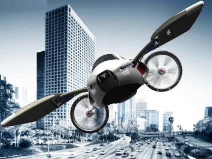
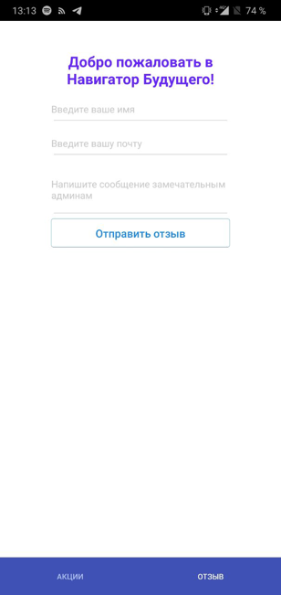
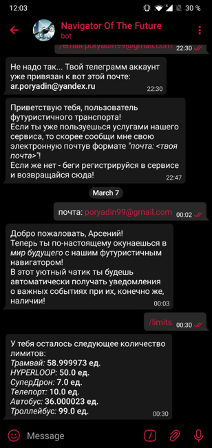

# Web Application Development coursework project

## Topic - "Transport of the Future"

List of used technologies:
* Backend - Java EE (jax-rs, 0Auth, JavaMail)
* Application Server - Payara (based on Glassfish)
* Frontend - React
* Database - PostgeSQL design and creation (+ Python scripts)
* ORM - Hibernate

Additional side features:
* Mobile application - React Native + Redux

* Telegram bot

